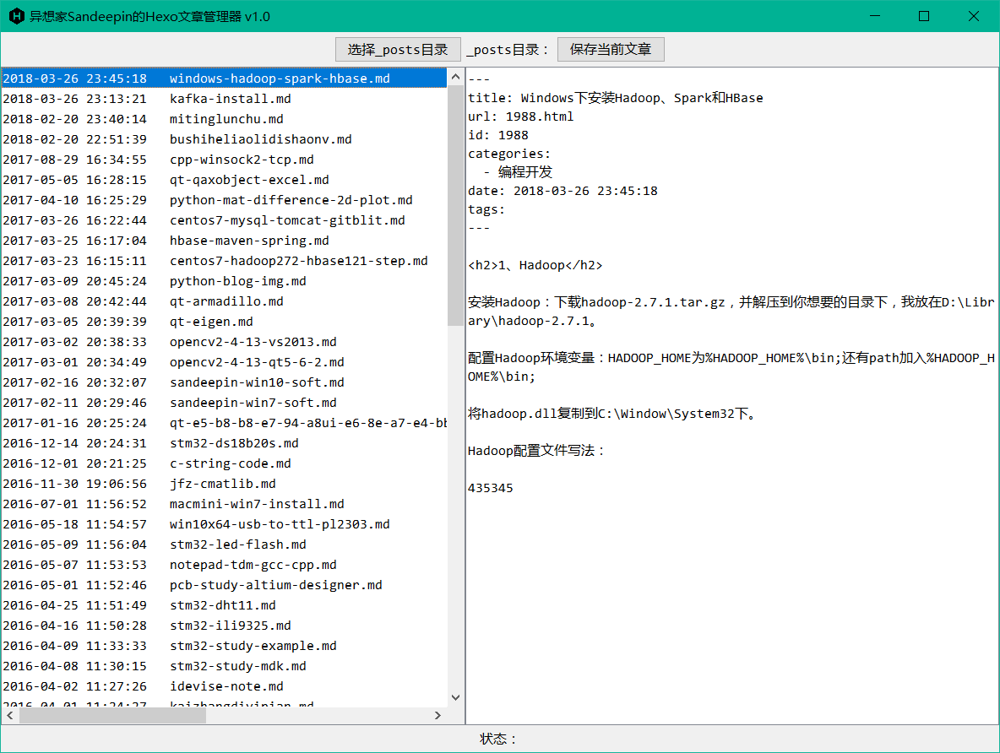

# hexoManager
方便管理整理自己博客文章的hexo文件管理器

写这个软件的初衷是自己WordPress博客的文章转到Hexo后排版都错位了，但是自己却想先改近期的文章，有空再改老的文章，但是_posts文件下的md文件却是以文件名排序的，不好改，于是想到用Java随便拖一个界面，把文章按时间顺序列出来，并且可以编辑，这样方便自己有兴趣的时候慢慢转文章。

软件原理很简单，就是读取hexo的source/_posts下文章，然后显示出来可编辑。由于自己没研究过Hexo，就没有精确解析文件了，什么页面也不支持改，最后附上自己的博客：blog.jfz.me，大家多来参观啊！

### 截图

### 更新日志

#### 2018年06月17日 v1.0
* 修复修改后界面显示文件内容不同步的问题。

#### 2018年06月16日 v1.0
* 发布勉强能用版本^_^（Bug还是很多的）